# Look Clock ⌚🏔️

An advanced Live Wallpaper creator for Android built with Flutter. It allows users to design, edit, and apply highly customized clocks that interact dynamically with the environment of their photographs.

## 🚀 Overview

**Look Clock** goes a step beyond simple text customization. It is a complete visual editor that integrates on-device image processing to achieve true depth effects (Z-Index). Through color detection algorithms and interactive masking tools, users can place the clock *behind* landscape elements (such as mountains or buildings) or submerge it under dynamic water effects.

## ✨ Key Features

* **🎨 Advanced Typographic Engine:** Support for font stretching (X/Y), *Glassmorphism* blur, interactive neon glows, contours, and parametric shadows.
* **⛰️ Depth Masks (Z-Index):** Automatic generation of alpha-channel masks from the base image, allowing precise layering behind landscape elements.
* **🖌️ Precision Eraser:** Interactive free-canvas editing tool. Allows erasing specific parts of the clock with stroke interpolation support and a complete Undo/Redo system.
* **🌊 Environmental Effects Engine:** Integration of a water layer with mathematical horizontal cuts, waterline opacity, and reflection blending.
* **🔗 Export Ecosystem:** Save complex configurations locally or share them externally. Generates compressed JSON schemes via `zlib` that can be imported via files or *Deep Links* (`lookclock://import`).

## 🛠️ Tech Stack & Development Flow

* **Framework:** Flutter (Dart) with a native `MethodChannel` for implementing the Live Wallpaper service in Android.
* **Image Processing:** `image` package for raw byte decoding, alpha mask generation, and crop interpolation.
* **State Management:** Reactive system supported by the *SchedulerBinding* lifecycle and a circular snapshot stack (`_EditorSnapshot`) to handle the Undo/Redo history.
* **Local Storage:** `shared_preferences` for lightweight UI configurations and retention of "Look" projects.
* **File Management & Sharing:** Deep file manipulation via `path_provider`, combined with Base64+Zlib compression for Deep Linking through `share_plus`.

## 📱 App Showcase & Editing Interface

Unlike a traditional overlaid clock, Look Clock allows you to play with environmental refraction and interactive light through its editing engine.

### 🌊 Dynamic Immersion Effect & ✨ Advanced Typographic Engine
Mathematical canvas cropping and waterline opacity to simulate sinking and refraction, combined with native rendering for Glassmorphism and Neon effects.

<table width="100%" cellspacing="0" cellpadding="0">
  <tr>
    <td width="50%" align="center" valign="top">
      
    </td>
    <td width="50%" align="center" valign="top">
      
    </td>
  </tr>
</table>

 

### ⛰️ Layer & Z-Index Engine & 🖌️ Precision Eraser
Management of overlapping planes via interactive cuts, alongside free-canvas editing with stroke interpolation for millimetric mask adjustments.

<table width="100%" cellspacing="0" cellpadding="0">
  <tr>
    <td width="50%" align="center" valign="top">
      
    </td>
    <td width="50%" align="center" valign="top">
      
    </td>
  </tr>
</table>

 

 

## 🖼️ Results Gallery (Looks)

A small sample of what can be created by combining depth tools, fonts, and rendering effects.

<table width="100%" cellspacing="0" cellpadding="0">
  <tr>
    <td width="33.3%" align="center" valign="top">
      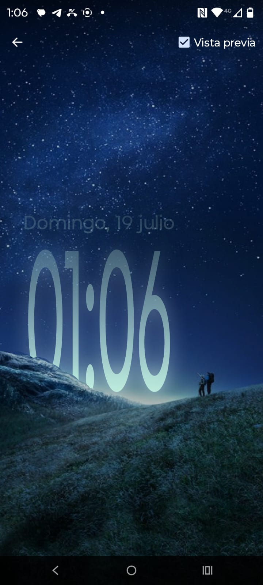
    </td>
    <td width="33.3%" align="center" valign="top">
      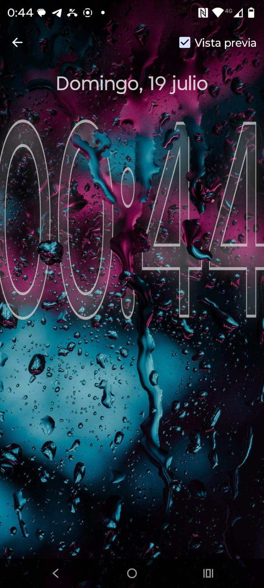
    </td>
    <td width="33.3%" align="center" valign="top">
      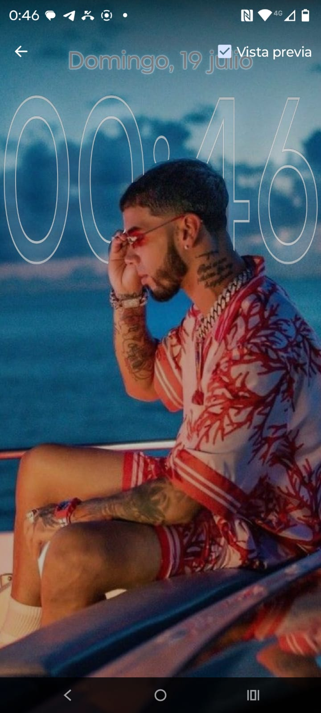
    </td>
  </tr>
  <tr>
    <td width="33.3%" align="center" valign="top">
      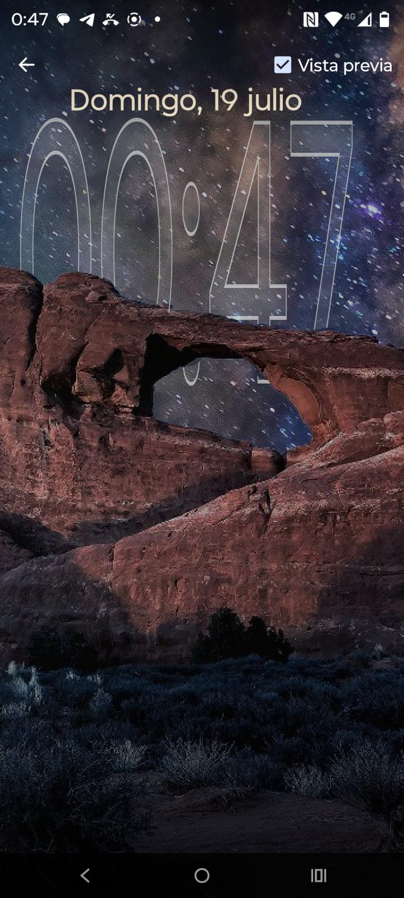
    </td>
    <td width="33.3%" align="center" valign="top">
      
    </td>
    <td width="33.3%" align="center" valign="top">
      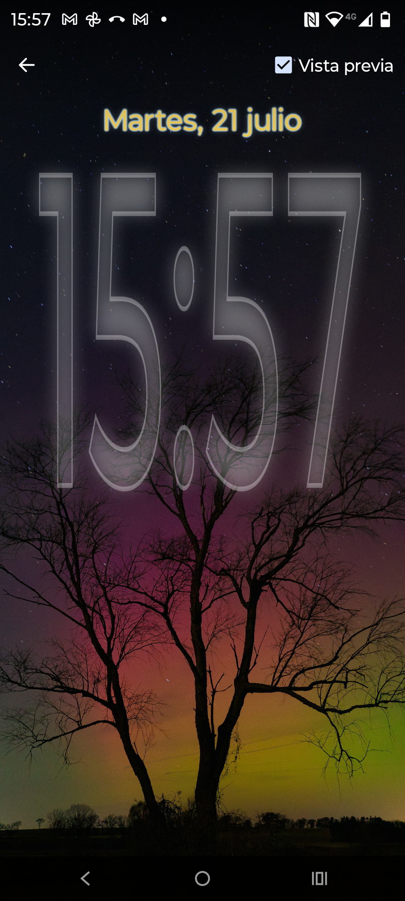
    </td>
  </tr>
  <tr>
    <td width="33.3%" align="center" valign="top">
      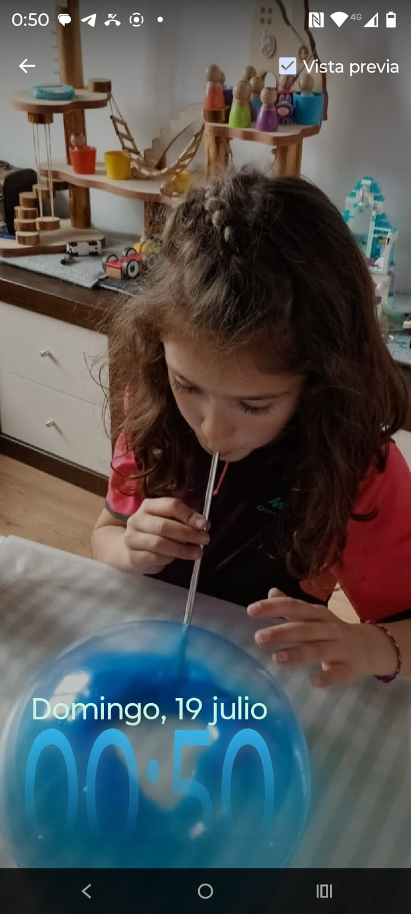
    </td>
    <td width="33.3%" align="center" valign="top">
      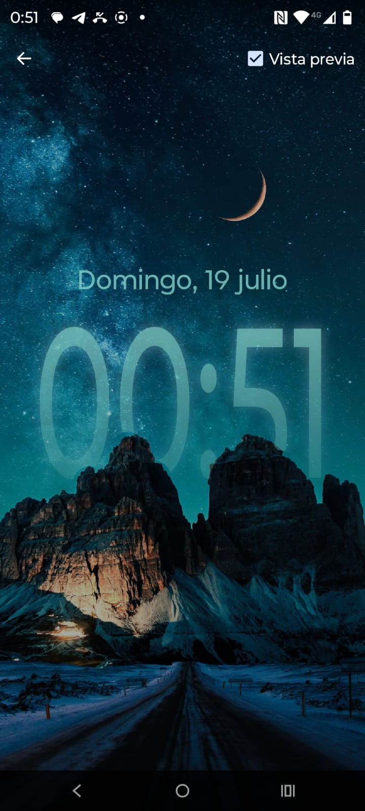
    </td>
    <td width="33.3%" align="center" valign="top">
      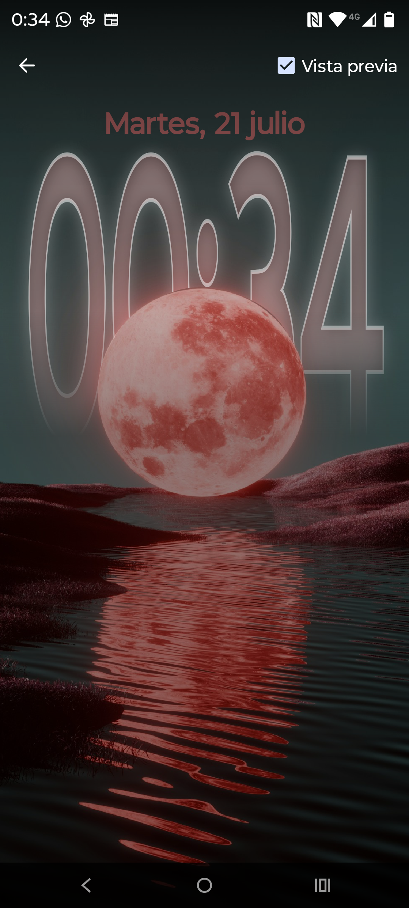
    </td>
  </tr>
  <tr>
    <td width="33.3%" align="center" valign="top">
      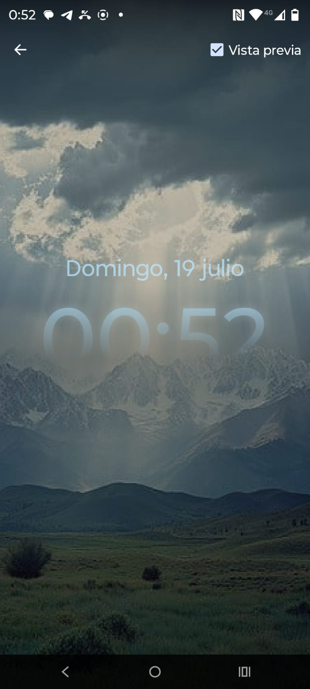
    </td>
    <td width="33.3%" align="center" valign="top">
      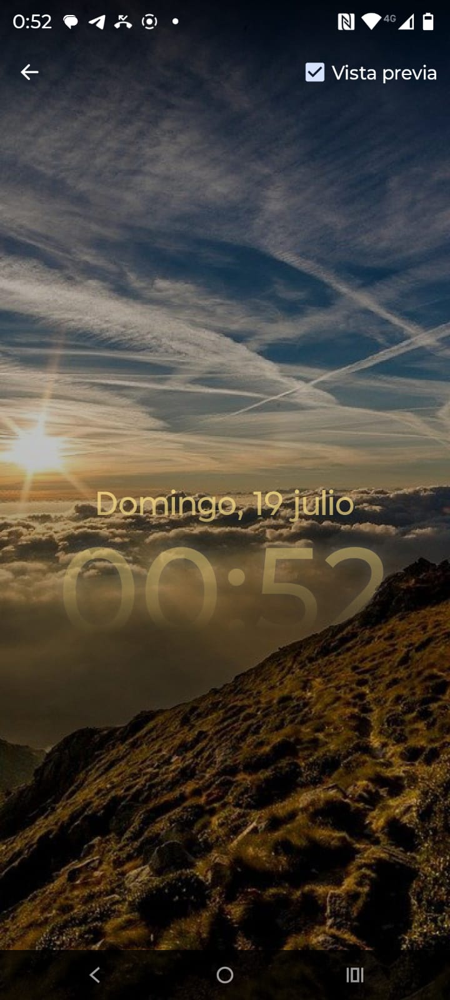
    </td>
    <td width="33.3%" align="center" valign="top">
      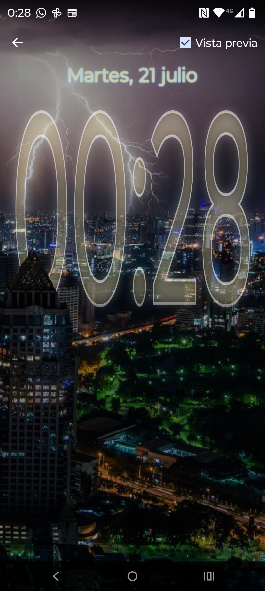
    </td>
  </tr>
  <tr>
    <td width="33.3%" align="center" valign="top">
      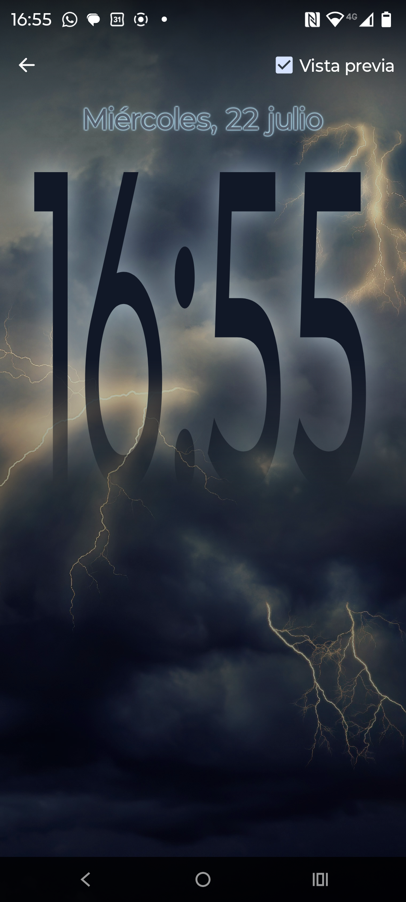
    </td>
    <td width="33.3%" align="center" valign="top">
      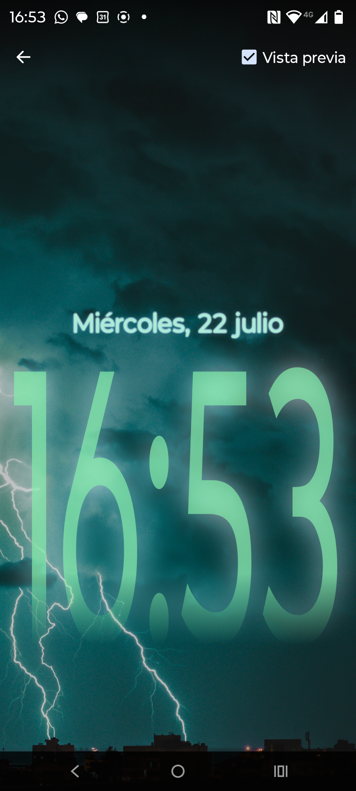
    </td>
    <td width="33.3%" align="center" valign="top">
      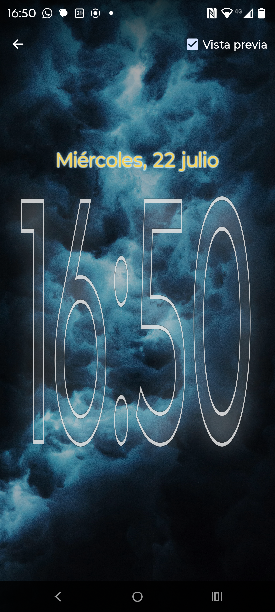
    </td>
  </tr>
  <tr>
    <td width="33.3%" align="center" valign="top">
      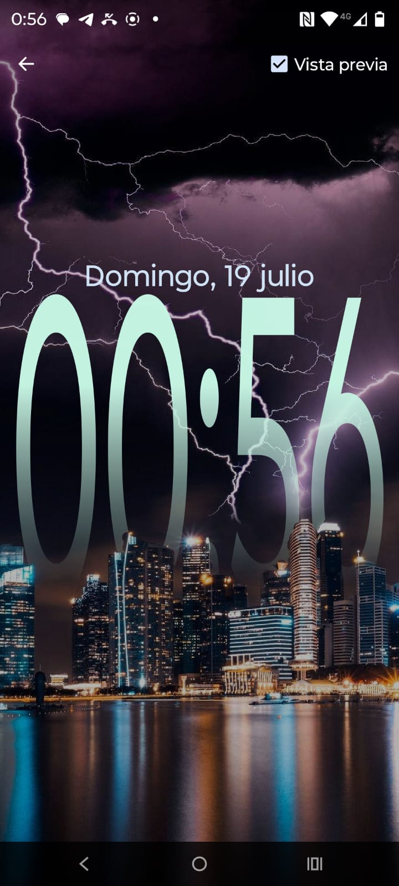
    </td>
    <td width="33.3%" align="center" valign="top">
      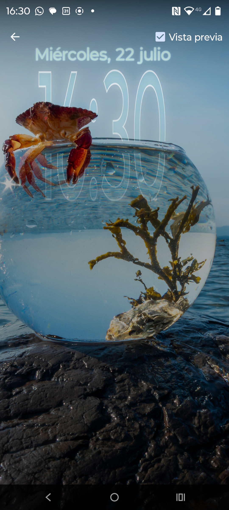
    </td>
    <td width="33.3%" align="center" valign="top">
      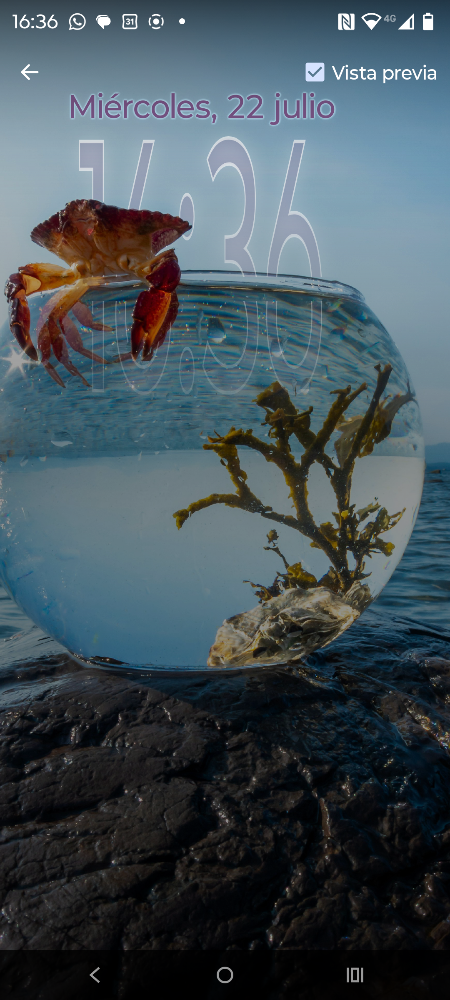
    </td>
  </tr>
  <tr>
    <td width="33.3%" align="center" valign="top">
      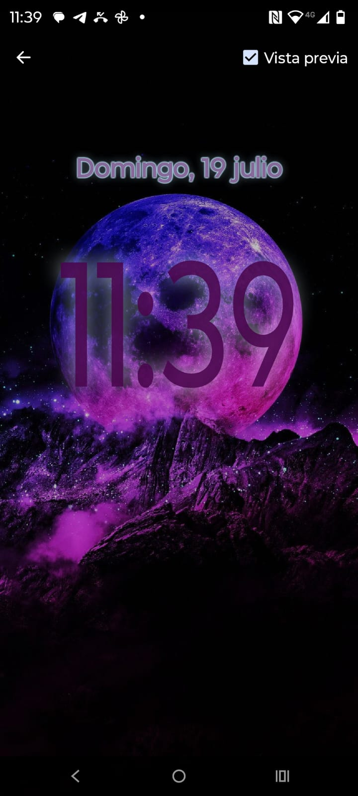
    </td>
    <td width="33.3%" align="center" valign="top">
      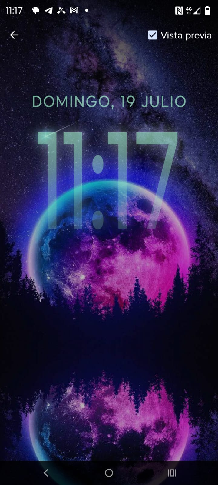
    </td>
    <td width="33.3%" align="center" valign="top">
      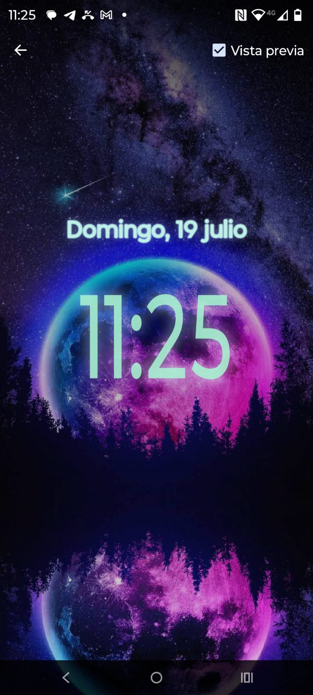
    </td>
  </tr>
</table>